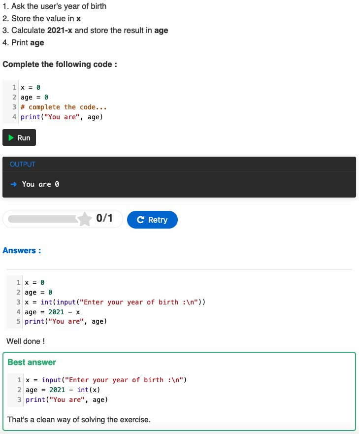

# H5P Python activity 

[](https://github.com/Hipjea/h5p-pyth5p/actions)

Add runnable Python code snippet. 

PytH5P also allows the snippet to be an exercise with feedbacks provided as a solution.

---

### Screenshot :



---

### Dependencies :

This package relies on [Skupt](https://github.com/skulpt/skulpt) for the Python interpretor, [CodeMirror](https://github.com/codemirror/CodeMirror) for the code editor part, [React](https://github.com/facebook/react) and [Typescript](https://www.typescriptlang.org) on the frontend application.

---

### Run Storybook :

```
yarn storybook
```

---

### Build the project :

```
npm run build:prod
```

or

```
yarn build:prod
```

---

### Create the h5p export :

```
h5p pack H5P.PytH5P pyth5p.h5p
```
